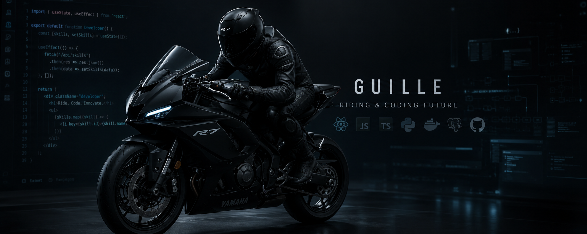

  

  <h1>Hey! Soy Guille 🏍️</h1>

  

  

    <strong>Desarrollador apasionado por el código y las dos ruedas.</strong> 
    Transformando cafeína y kilómetros en soluciones digitales.
  

  
  

## 🛠️ Tecnologías y Herramientas

  

## 📊 GitHub Stats

  
  

## 🚀 Proyectos Destacados

  
  
  

  🏁 <i>¡Gas y buen código!</i> 🏁

